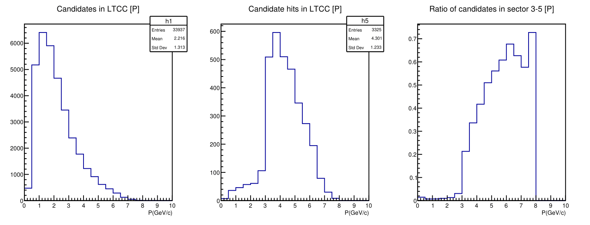
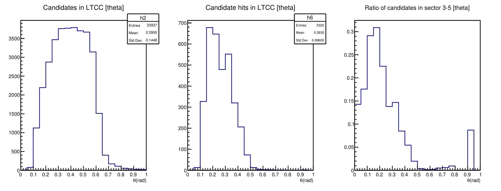
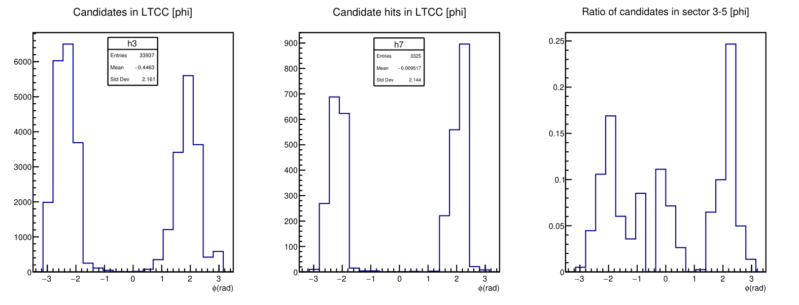
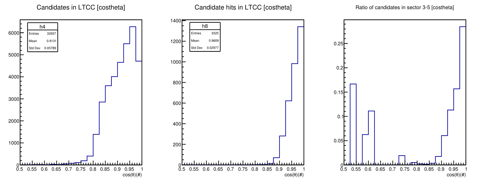
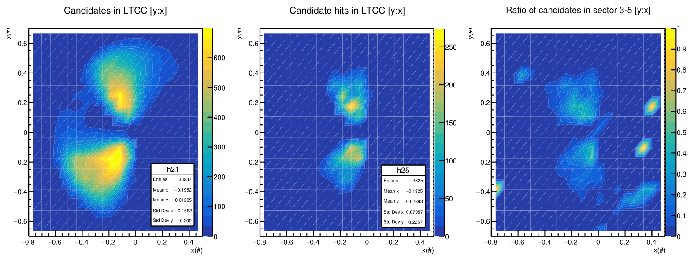
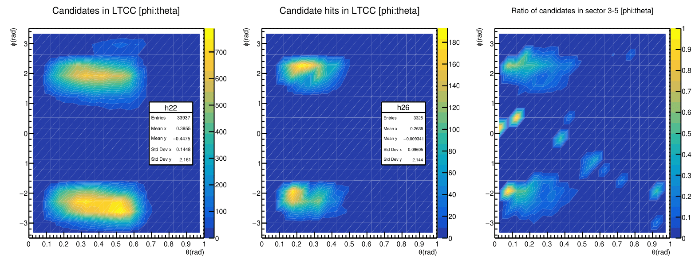
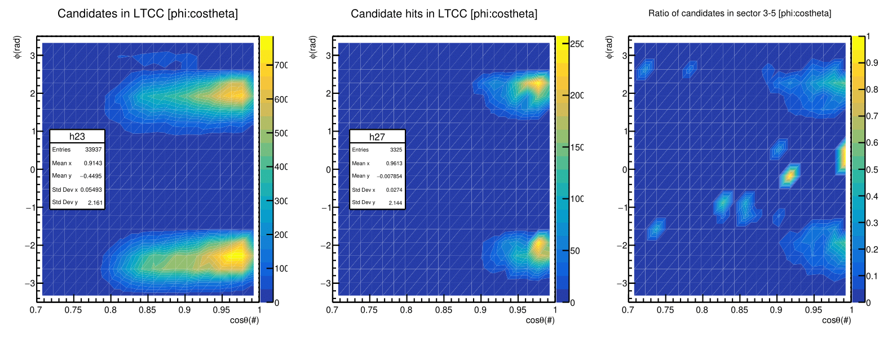
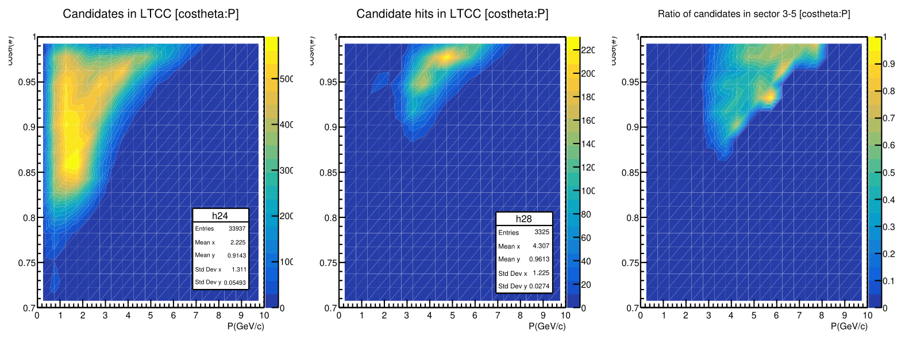

# LTCCefficiency

Code to analyze the efficiency of the LTCC CLAS12 detector.

The **clas12root** library is needed. For a local installation see [clas12root installation](https://github.com/clas12brescia/LTCCefficiency/blob/main/misc/clas12root_installation.md), for an ifarm machine at JLab with bash:
```bash
source /group/clas12/packages/setup.sh && module load clas12
```

## What this macro does?

LTCCefficiency.cxx - with makeHistos.cxx - is a clas12root macro to calculate the efficiency of the LTCC CLAS12 detector for charged 
candidate with intermediate mass.
To do this, a list of hipo files' paths in a .dat or .txt file is required as input (by terminal).
For details on the reading method, see the following sections. 

## How does the macro work?

This macro reads a list of hipo files and saves the useful variables in a TTree, selecting events by filters and cuts.
The quantities of interest for this analysis are the following:

* Momentum of the candidates (P, GeV/c);
* Polar angle (&theta;, rad);
* Azimuthal angle (&phi;, rad);
* Cosine of the polar angle (cos(&theta;));
* Number of photoelectrons in LTCC (N<sub>phe</sub>);
* Missing mass (mm, GeV/c<sup>2</sup>).

Cuts on kinetic variables are applied to obtain a clear missing mass peak and to select the events the most accurately possible.
The events we are interested in are: e + p &rarr; &pi;<sup>+</sup> + n + *neutrals*.
The cuts applied are:

* cut on missing mass (between 0.88 and 1 GeV), so that is near the neutron mass (~0.94 GeV);
* cut on the polar angle of the transferred momentum: q<sub>t</sub>/q<sub>z</sub> > 0.12.

The candidated particles in this macro are identified **without** the use of PID. 
Instead, they are selected using the following requests:

1. events with no more than **one or two charged tracks** are selected;
1. one of these tracks must be an **electron**;
1. the electron must be in the **FD region** but **outside sectors 3 and 5**;
1. **no "heavy" particles** (deuton, proton or heavier baryons) are admitted in the active region;

The particles used for this selection (e.g. electron, proton, deuton) are identified by their PID.
The selected particles are charged particles with intermediate mass (e.g. pions, kaons).

The user can enable/disable the particle selection by PID. To do this, change the following lines in the code:

```c++
bool option_identified_pid=true/false;
int identified_pid=211;
```

Using the ROOT macro `makeHistos.cxx`, all the variables are used to create histogram of their distributions, eventually with some conditions to 
calculate the efficiency of the LTCC. For details, see below.

## How to run the macro

Clone the repository with:
```bash
git clone https://github.com/clas12brescia/LTCCefficiency.git
cd LTCCefficiency
```
Run with:
```bash
clas12root LTCCefficiency.cxx --in=input_filename.dat   
```
where `input_filename.dat` contains the paths of the hipo files used for the analysis (see section *Note*).
This file can be created using the command:
```bash
ls -1 /directory/of/hipo/files/*.hipo > input_filename.dat
```
that put the paths of all hipo files present in the directory (if the run list is too long an *Argument list too long* error can be avoided [using find instead of ls](./using_find_instead_of_ls.md)).

**IMPORTANT**: 
The input file can also be a single .hipo file. For multiple hipo files reading, use only the method with the .dat/.txt file or modify the readfiles.cxx file with the method you prefer.


After the run finishes, the TTree can be found in the root file `LTCCefficiency_tree_input_filename.root`.
To see and produce the useful histograms, two methods can be used:
* **Interactive**: access the TTree with:
```bash
root -l LTCCefficiency_tree_input_filename.root
root[1] treeHisto->Print()
```
This command prints the structure and variables of the TTree. 
Then, the other commands and options (like Draw() or Show()) of the [TTree class](https://root.cern.ch/doc/master/classTTree.html) can be used to explore the TTree and create and save the desired histograms.
For this purpose, two empty 1D-histograms (`hall` and `hnphe`) are present to be used in the interactive mode.
* **Pre-defined macro**: the useful histograms are created by the ROOT macro `makeHistos.cxx` with:
```bash
root -l 'makeHistos.cxx("LTCCefficiency_tree_input_filename.root")'
```

A total of 8 canvases are created, each one composed by three 1D- or 2D-histograms:
1. The variable distribution for candidates in LTCC;
1. The variable distribution for candidates with signal (i.e. N<sub>phe</sub>>1) in LTCC active sectors (3 and 5);
1. The ratio between the previous two histograms (i.e. the efficiency).
 
These canvases are saved in a ROOT and a pdf file named `out_input_filename.root/.pdf`.
The histograms are the following:










## Notes

All the figures were obtained using this macro on a file list of 1038 hipo files (about 400 millions events).
The hipo files used are from the first 5 spring2019 runs, directories 006616, 006618, 006619, 006620 and 006631. 

The complete list of this paths for all the file used in these macros can be found in the dat file `input_spring2019_first5run.dat`.

