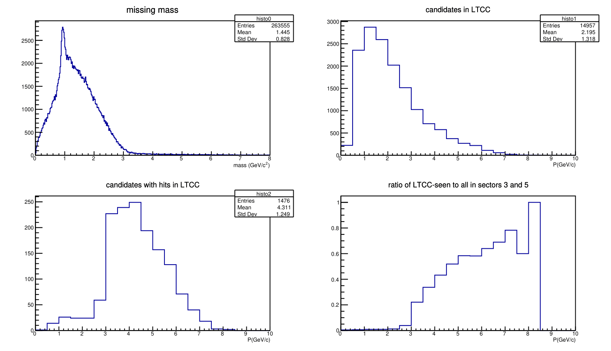
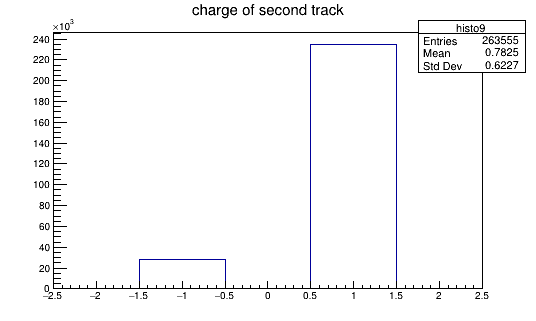
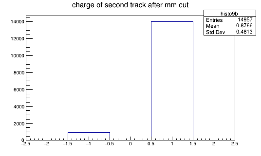
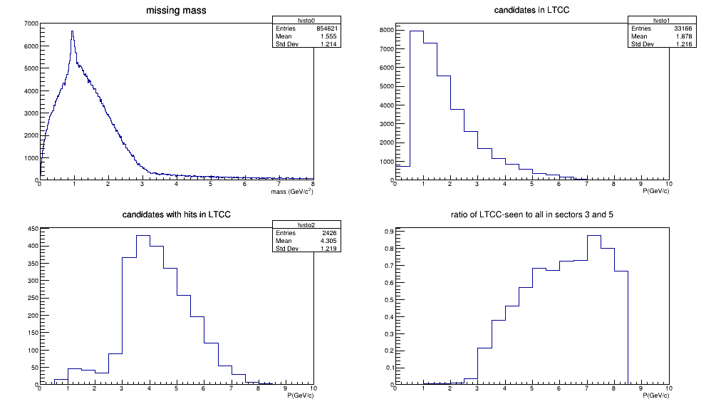

# LTCCefficiency

Code to analyze the efficiency of the LTCC CLAS12 detector.

The **clas12root** library is needed. For a local installation see [clas12root installation](https://github.com/clas12brescia/LTCCefficiency/blob/main/misc/clas12root_installation.md), for an ifarm machine at JLab with bash:
```bash
source /group/clas12/packages/setup.sh && module load clas12
```


## What this macro does?

LTCCefficiency.cxx is a clas12root macro to calculate the efficiency of the LTCC CLAS12 detector for charged candidate with intermediate mass.
To do this, a list of hipo files' paths in a .dat or .txt file is required as input (by terminal).
For details on the reading method, see the following sections. 

## How does the macro work?

This macro reads a list of hipo files, draws and saves histograms of some distributions of pions' momentum with different cuts and filters.
The histograms of interest for this analysis are the following:

* **Missing Mass**: the peak is in the correspondence of the neutron mass (~0.94 GeV);
* **Momentum of particles in LTCC**: only the particles that entered in the geometrical region of the LTCC, in the active sectors (3 and 5) are selected;
* **Momentum of hits in LTCC**: only particles with a signal in LTCC (N<sub>phe</sub>>1) are selected;    
* **Efficiency**: estimation of the efficiency for identification of pions in LTCC. The estimation is calculated as the ratio of the previous two histograms.

Cuts on kinetic variables are applied to obtain a clear missing mass peak and to select the events the most accurately possible.
These cuts are:

* cut on missing mass (between 0.88 and 1 GeV), so that is near the neutron mass (~0.94 GeV);
* cut on the polar angle of the transferred momentum: q<sub>t</sub>/q<sub>z</sub> > 0.12.

The candidated particles in this macro are identified **without** the use of PID. 
Instead, they are selected using the following requests:

1. events with no more than one or two charged tracks are selected;
1. one of these tracks must be an electron;
1. the electron must be in the FD region but outside sectors 3 and 5;
1. no "heavy" particles (deuton, proton or heavier baryons) are admitted in the active region.

The particles used for this selection (e.g. electron, proton, deuton) are identified by their PID.
The selected particles are charged particles with intermediate mass (e.g. pions, muons, kaons).

**Extra-feature**: the user can enable/disable the particle selection by PID. To do this, change the following lines in the code:

```c++
bool option_identified_pid=true/false;
int identified_pid=211;
```

## How to run the macro

Clone the repository with:
```bash
git clone https://github.com/clas12brescia/LTCCefficiency.git
cd LTCCefficiency
```
Run with:
```bash
clas12root LTCCefficiency.cxx --in=input_filename.dat   
```
where `input_filename.dat` contains the paths of the hipo files used for the analysis (see section *Note*).
This file can be created using the command:
```bash
ls -1 /directory/of/hipo/files/*.hipo > input_filename.dat
```
that put the paths of all hipo files present in the directory.


After the run finishes, the histograms can be found in the root file `out_LTCCefficiency.root`.
To see the main histograms of the analysis, run the ROOT macro `viewHistos.cxx` with:

```bash
root -l viewHistos.cxx
```

As default, this macro looks for the file named `out_LTCCefficiency.root`. 
If changes on the output file name have been done, use:

```bash
root -l 'viewHistos.cxx("output_name.root")'
```

The ouput will be something like this:



This output is also saved in a pdf file with the same name of the ROOT file.

Many other histograms are showed with `viewHistos.cxx`. (FIGURES: COMING SOON).

Two extra histograms are present in this analysis. They are charges distribution of the candidated particles, before and after the missing mass cut.
To draw these histograms, run:

```bash
root -l out_LTCCefficiency.root
root[1] histo9->Draw()
root[2] histo9b->Draw()
```





# LTCCefficiency_PID

LTCCefficiency_PID.cxx is an alternative to the first macro.
It estimates the efficiency of the LTCC CLAS12 detector, but the candidates are selected via PID identification.
In this specific case, the analysis is done on &pi;<sup>+</sup> (PID=211).

The contents of the two macros sligthly differs: 
* The classes used are the same.
* The kinematic cuts are the same. 
* The readfiles method is the same.
* The run and the outputs work in the same way.

However, the different selection of candidates gives different results.
The first macro select as candidates a wider range of intermediate mass particles (muons, pions and kaons), while the second one select only the particles which are labeled with PID=211 (&pi;<sup>+</sup>). 

After the run finishes (see the *How to run the macro* section above), the histograms can be found in the ROOT file `out_LTCCefficiency_PID.root`.
To see the main histograms of the analysis, run the ROOT macro `viewHistos.cxx` and modify the argument of the macro, as described above:

```bash
root -l 'viewHistos.cxx("out_LTCCefficiency_PID.root")'
```
The ouput will be something like this:



This output is also saved in a pdf file with the same name of the ROOT file.

## Note

All the figures were obtained using this macro on a file list of about 500 hipo files.
The hipo files used are from spring2019 run, directories 006616, 006695 and 006710. 
Path of the files:

`/cache/clas12/rg-a/production/recon/spring2019/torus-1/pass1/v0/dst/recon/006616`

`/cache/clas12/rg-a/production/recon/spring2019/torus-1/pass1/v0/dst/recon/006695`

`/cache/clas12/rg-a/production/recon/spring2019/torus-1/pass1/v0/dst/recon/006710`

The complete list of this paths for all the file used in these macros can be found in the dat file `input_spring2019.dat`.

<!---
#### Miscell.
---
[Passwordless git access](https://github.com/clas12brescia/LTCCefficiency/blob/main/misc/passwordless-git.md)
---
[clas12root installation](https://github.com/clas12brescia/LTCCefficiency/blob/main/misc/clas12root_installation.md)
--->  
