# Examples

Very very simple macros for clas12root

### simple.C

Open a file and print for each event the number of particles of that event
```bash
clas12root -b -q simple.C
```
### simple2.C

Same as simple.C without printing, save the number of particles distribution in a histogram into a `out_histos.root` file
```bash
clas12root -b -q simple2.C
```
Then the histogram can be found in the ROOT file:
```bash
root -l out_histos.root
root[1] multip->Draw()
```

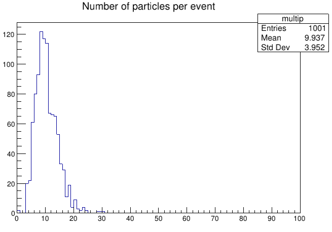

### simple3.C

Open a file and save momentum and angular -phi and theta- distributions (selecting only electrons) in three histograms into a `out_simple3.root` file.
Run with:
```bash
clas12root -b -q simple3.C
```
Then the histrograms can be found in the ROOT file:
```bash
root -l out_simple3.root
root [1] mom->Draw()
```
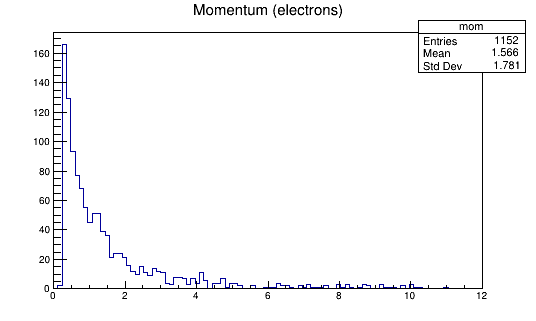
```bash
root[2] phi->Draw()
```
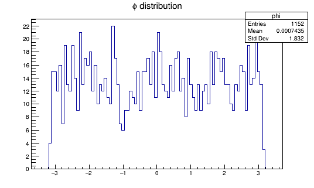
```bash
root[3] theta->Draw()
```
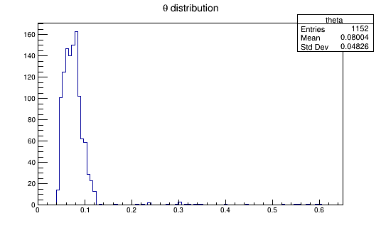

### simple4.C

Open two hipo file (using HipoChain) and save histograms of some distributions.
Electrons must be in the FT region and a constraint on the difference of time between these and photons is applied.
The distributions are the following:
* Scatter plot of transverse component of momentum p (p<sub>x</sub> and p<sub>y</sub>) of electrons;
* Transferred 4-momentum squared (q<sup>2</sup>);
* Transverse transferred 4-momentum squared (q<sub>x</sub><sup>2</sup>+q<sub>y</sub><sup>2</sup>);
* Difference between electrons and photons time (t<sub>e</sub> - t<sub>ph</sub>).

Run with:
```bash
clas12root -b -q simple4.C
```
Then the histograms can be found in the ROOT file `out_simple4.root`:
```bash
root -l out_simple4.root
root[1] pxy->Draw()
```
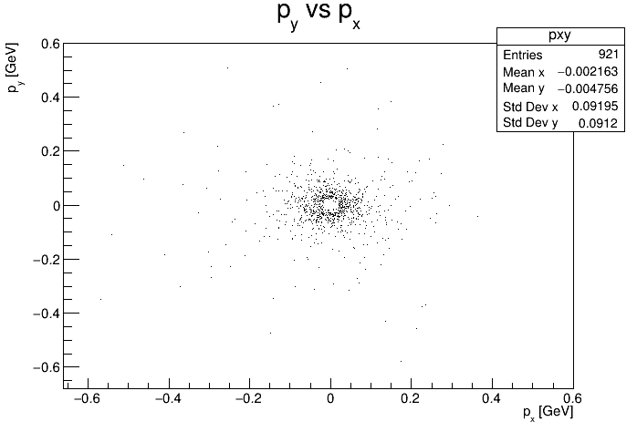
```bash
root[2] q2_histo->Draw()
```
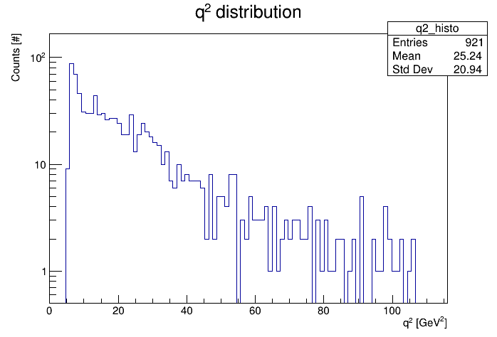
```bash
root[3] qt2_histo->Draw()
```
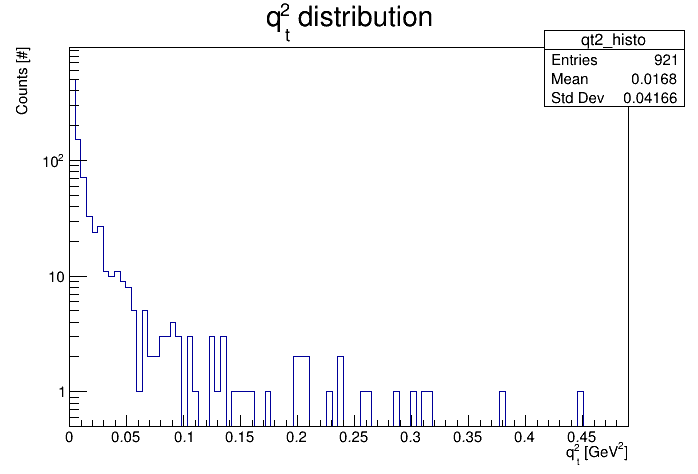
```bash
root[4] t->Draw()
```
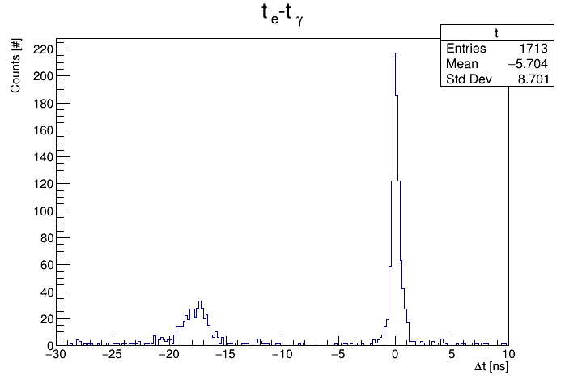

Histograms in `q2_histo.png` and `qt2_histo.png` files are setted in Log scale with the ROOT graphical editor. 

### simple5.C

Open two hipo files (using HipoChain) and save histograms of some distributions and the parameters of two fits.
Events are selected so that:
* there is only one electron, and this electron is in the FT region;
* there are two photons.

The distributions calculated in the macro are the following:
* the pi0 mass, from the sum of photons 4-momenta;
* the delta time of the two gammas;
* the scatter plot between delta times of electron and photons.

The first two histograms are in a single canvas. In these 1D-histograms fits with a gaussian (for mass) and a Cauchy-Lorentz distribution (for time) are done.
The parameters for both are saved in a txt file. 

Run with:
```bash
clas12root -b -q simple5.C
```
Then the histograms can be found in the ROOT file `out_simple5.root`:
```bash
root -l out_simple5.root
```

To draw the canvas with the two 1D-histograms:
```bash
root[1] c_hfit->Draw()
```

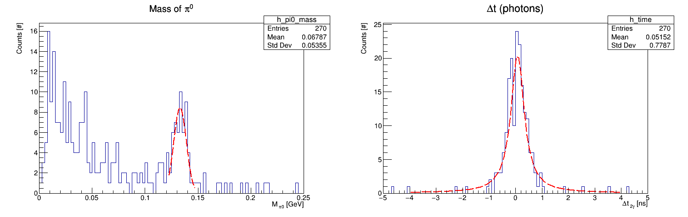

To draw the 2D-histogram of electron-photons times:
```bash
root[2] h_time2->Draw()
```

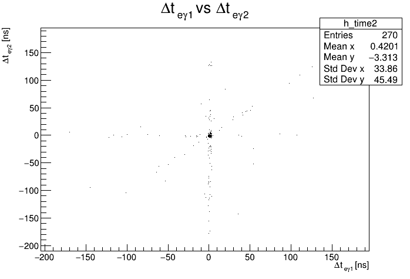

To see the parameters of the fitting functions and their names, open the file `fit_par.txt` in a text editor. 
In the figure below, the content of the txt file.

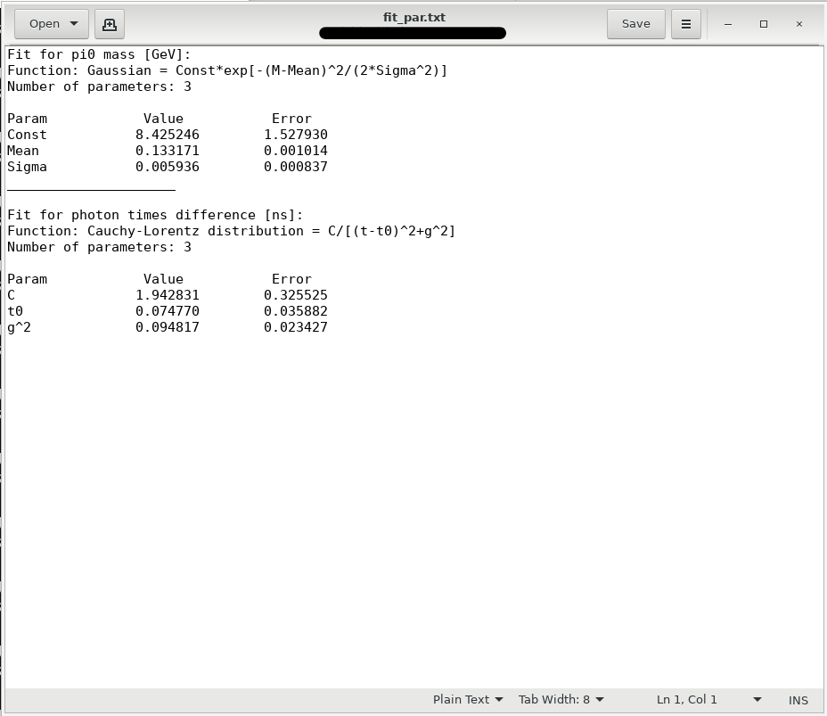 

### LaTeX symbols (tests)

&pi ;pi \\pi $pi$ $$pi$$ &pi; &#960; 
